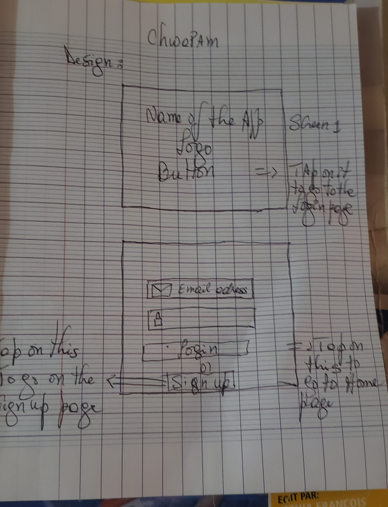
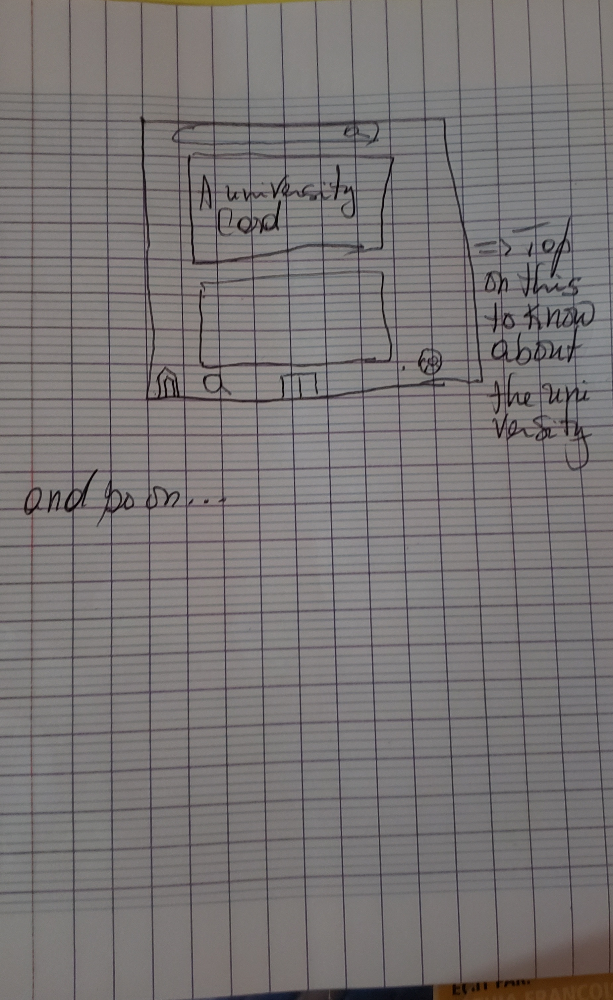

# LES-MONITEURS
# Groups Members:
# Tamarra RICHEMOND
# Jessica RINVIL
# Jack ETHYL FIls
# Mahatma C.Sycia Amelida Dormeus
# Claudy OFILIEN
# Jean Benshelove

# App ideas:
- [x] •	An app that helps students explore academic programs offered by different universities, allowing them to quickly understand requirements, costs, and career opportunities.
- [x] •	An app where universities can manage and update their program information, making it easier to reach potential students.
- [x] •	An app that helps high-school graduates take a career-interest quiz, then gives them personalized recommendations based on their strengths and goals.
- [x] •	An app that centralizes all universities in Haiti, allowing students to compare tuition, admission criteria, and program duration in one place.

# Final App Idea: 
- [x] Choosing a career path right after high school can feel overwhelming, especially when students have limited access to clear, organized information about universities and the programs they offer. ChwaPam is a mobile application designed to simplify that process by creating a dynamic bridge between students and universities.
Through the app, universities can create accounts and directly upload or manage detailed information about their institution, including programs offered, admission requirements, campus descriptions, tuition details, and opportunities such as scholarships. Students, in turn, can explore these programs, compare options, save favorites, and find guidance toward a career path that fits their goals and interests.

# ChwaPam empowers both sides:
- [x] •	Universities gain a centralized space to promote their programs and reach students more easily.
- [x] •	Students get an intuitive tool to discover their future with clarity and confidence.

# User Stories:

Must Have
•	Students should be able to create an account using basic info (name, email, password) to personalize their experience.
•	Universities should be able to create an official account to manage and update their program information.
•	Universities should be able to add a new academic program, including:
	Program name
	Description
	Required qualifications (e.g., diploma, skills)
	Duration
	Cost/tuition
	Career opportunities
	Optional images or promotional banners
	Students should be able to browse all available programs across all registered universities.
	Students should be able to filter programs by category (e.g., IT, business, medicine, arts) or by university.
	Students should be able to select a program to see its full details on a dedicated page.
	Students should be able to save favorite programs to review later.
	Universities should be able to edit or delete their own program listings at any time.
Maybe
•	Students should be able to compare two or more programs side-by-side (requirements, cost, duration).
•	Students should be able to rate or leave feedback on programs after attending an orientation session or campus visit.
•	Universities can upload short videos (campus life, lab tours, testimonials).
•	Students can complete a small orientation quiz to discover suggested career paths based on their interests.
•	Universities can highlight special announcements, such as:
•	Scholarship deadlines
•	Open days
•	New program launch
•	Students can chat with university representatives through an integrated messaging system.

Would Be Nice to Have
•	Universities can view simple analytics, such as how many students viewed or saved their programs.
•	A personalized suggestion engine that recommends programs based on a student’s saved items and quiz results.
•	Dark mode for better accessibility and pleasant nighttime browsing.

Design:

 
 

 

 

 
